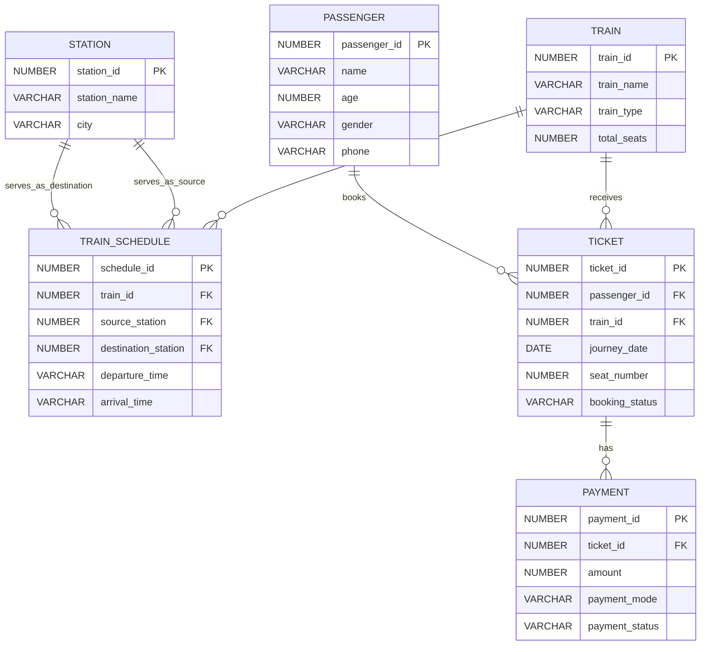

# 🚆 Railway Management System

> An Oracle Database course project that models railway schedules, passengers, ticket bookings, payments, seat occupancy, and revenue reporting.

## 📑 Table of Contents

- [Project Overview](#project-overview)
- [Problem Statement](#problem-statement)
- [Objectives](#objectives)
- [Main Features](#main-features)
- [Database Design](#database-design)
- [Database Tables](#database-tables)
- [Technologies and Concepts](#technologies-and-concepts)
- [Project Structure](#project-structure)
- [How to Run the Project](#how-to-run-the-project)
- [Example Operations](#example-operations)
- [Views and Trigger](#views-and-trigger)
- [Sample Dataset](#sample-dataset)
- [Current Limitations](#current-limitations)
- [Future Improvements](#future-improvements)
- [Learning Outcomes](#learning-outcomes)
- [Team Members](#team-members)
- [Project Presentation](#project-presentation)

---

<a id="project-overview"></a>
## 📌 Project Overview

The **Railway Management System** is a relational database project developed for a Database Management Systems course. It demonstrates how Oracle SQL and PL/SQL can be used to organize and manage important railway data.

The system stores information about:

- Trains and their seat capacities
- Railway stations and cities
- Train routes and schedules
- Passengers
- Ticket bookings
- Payment records
- Seat occupancy
- Daily revenue

The project focuses on database design and SQL operations rather than a graphical user interface.

---

<a id="problem-statement"></a>
## ❓ Problem Statement

Railway operations generate connected data from train schedules, stations, passenger bookings, seats, and payments. Managing these records manually can cause duplication, inconsistency, and difficulty when producing reports.

This project solves the problem by storing the data in related tables and using database constraints, queries, views, and a trigger to maintain consistency and support useful analysis.

---

<a id="objectives"></a>
## 🎯 Objectives

- Apply DBMS concepts to a practical railway-based scenario
- Design a structured relational database
- Connect related entities using primary and foreign keys
- Store sample railway, passenger, booking, and payment data
- Retrieve information using joins and nested queries
- Analyze seat occupancy and daily revenue using views
- Automatically enforce a payment-related business rule using a trigger

---

<a id="main-features"></a>
## ✨ Main Features

### 🚆 Train and Route Information

- Display trains with their source and destination stations
- Show departure and arrival times
- Store train types and total seat capacities

### 🔎 City-Based Train Search

- Search for trains using source and destination cities
- Perform case-insensitive city matching

### 🎟️ Passenger and Ticket Management

- Retrieve passengers booked on a selected train
- Store journey dates and seat numbers
- Track confirmed and cancelled tickets
- Filter confirmed tickets within a date range

### 📊 Database Reporting

- Compare booked seats with total seats for every train
- Calculate available seats
- Calculate revenue by journey date from successful payments

### ⚙️ Automated Payment Handling

- Automatically cancel a ticket when its payment status changes to `FAILED`

---

<a id="database-design"></a>
## 🧩 Database Design

The database contains six main entities and their relationships.



### Relationship Summary

- One train can have multiple schedules.
- One station can be used as the source or destination of multiple schedules.
- One passenger can book multiple tickets.
- One train can have multiple tickets.
- A ticket can have related payment records.

---

<a id="database-tables"></a>
## 🗃️ Database Tables

| Table | Purpose | Important Constraints |
|---|---|---|
| `Train` | Stores train details and total seats | Primary key; positive seat capacity |
| `Station` | Stores stations and their cities | Primary key; unique station name |
| `Train_Schedule` | Connects trains with source and destination stations | Foreign keys to `Train` and `Station` |
| `Passenger` | Stores passenger information | Primary key; positive age; unique phone number |
| `Ticket` | Stores booking and journey information | Foreign keys to `Passenger` and `Train` |
| `Payment` | Stores payment information for tickets | Foreign key to `Ticket`; positive amount |

---

<a id="technologies-and-concepts"></a>
## 🛠️ Technologies and Concepts

### Technology

- **Database:** Oracle Database
- **Languages:** SQL and PL/SQL
- **Suggested tools:** Oracle SQL Developer or SQL*Plus

### DBMS Concepts Used

- Relational database design
- Entity-Relationship modeling
- Primary and foreign keys
- `NOT NULL`, `UNIQUE`, and `CHECK` constraints
- SQL joins
- Nested queries and subqueries
- Bind and substitution variables
- Aggregate functions
- Grouping and filtering
- Views
- Row-level trigger
- Date filtering

> **Note:** This project uses Oracle-specific features such as `NUMBER`, `VARCHAR`, `TO_DATE`, PL/SQL triggers, and `/` as the execution delimiter. It is therefore described as an **Oracle Database project**, not a MySQL project.

---

<a id="project-structure"></a>
## 📁 Project Structure

```text
Railway-Management-System_DBMS_PROJECT-main/
├── 01_Schma_User.sql
├── 02_Tables.sql
├── 03_Data_Input.sql
├── 04_Features.sql
├── 05_Views_Triggers.sql
├── TEST.sql
├── Railway-Management-System_Presentation_G#01.pptx
└── README.md
```

| File | Description |
|---|---|
| `01_Schma_User.sql` | Selects the Oracle pluggable database, creates the project user, and grants privileges |
| `02_Tables.sql` | Creates all six database tables and their constraints |
| `03_Data_Input.sql` | Inserts the sample records |
| `04_Features.sql` | Contains the main retrieval and search queries |
| `05_Views_Triggers.sql` | Creates the occupancy view, revenue view, and payment-failure trigger |
| `TEST.sql` | Contains additional join and reporting queries |
| `Railway-Management-System_Presentation_G#01.pptx` | Course presentation for the project |

> The existing filename `01_Schma_User.sql` contains a spelling error. It can be renamed to `01_Schema_User.sql`; update any documentation or commands that reference it after renaming.

---

<a id="how-to-run-the-project"></a>
## ▶️ How to Run the Project

### Prerequisites

Install or obtain access to:

1. Oracle Database, such as Oracle Database Express Edition
2. Oracle SQL Developer or SQL*Plus
3. Permission to create a database user, or an existing Oracle user where the tables can be created

### Step 1: Configure the Project User

Open `01_Schma_User.sql` and replace the example password with your own secure password.

```sql
CREATE USER DBMS_PROJECT IDENTIFIED BY <YOUR_PASSWORD>;
```

The provided script switches to `XEPDB1`, which is commonly used by Oracle XE:

```sql
ALTER SESSION SET CONTAINER = XEPDB1;
```

Change the pluggable database name when your Oracle setup uses a different service.

> ⚠️ Do not publish a real database password in a public GitHub repository. For a course demonstration, use a placeholder such as `<YOUR_PASSWORD>` in shared code.

### Step 2: Run the SQL Files in Order

Run the scripts in this sequence:

```text
1. 01_Schma_User.sql       -- Run as an administrator when creating the user
2. 02_Tables.sql           -- Run while connected as the project user
3. 03_Data_Input.sql       -- Insert sample data
4. 04_Features.sql         -- Run the main queries
5. 05_Views_Triggers.sql   -- Create and test views and the trigger
6. TEST.sql                -- Run additional tests when needed
```

### Step 3: Use Input Variables

Some feature queries use variables such as:

```text
:source_city
:dest_city
:train_id
:start_date
:end_date
```

In Oracle SQL Developer, enter the requested values when the tool prompts you. Example values include:

```text
source_city = Dhaka
dest_city   = Sylhet
train_id    = 101
start_date  = 2026-01-01
end_date    = 2026-02-28
```

### Step 4: Verify the Database

Use these commands to confirm that the tables and views are available:

```sql
SELECT table_name FROM user_tables;
SELECT view_name FROM user_views;
SELECT trigger_name, status FROM user_triggers;
```

---

<a id="example-operations"></a>
## 🔍 Example Operations

### 1. Display Trains and Routes

The project joins the train, schedule, and station tables to display each train's route and time.

Expected information:

```text
Train Name | Source | Destination | Departure | Arrival
```

### 2. Search by Source and Destination City

A nested query finds trains whose schedule matches the selected source and destination cities.

Example:

```text
Dhaka → Sylhet
```

### 3. Find Passengers for a Train

The project retrieves passenger names from ticket records for a selected `train_id`.

For exact numeric matching, the recommended condition is:

```sql
WHERE train_id = :train_id;
```

This is clearer than using `LIKE` for a numeric identifier.

### 4. Filter Confirmed Tickets by Journey Date

The date-range query returns confirmed ticket records between two journey dates.

> This query filters **ticket journeys by date**. It does not directly filter schedules by departure time.

---

<a id="views-and-trigger"></a>
## 📈 Views and Trigger

### `view_train_occupancy`

Shows the number of confirmed bookings and remaining seats for each train.

```text
Train ID | Train Name | Total Seats | Booked Seats | Available Seats
```

The view uses a `LEFT JOIN`, allowing trains with no confirmed bookings to remain visible.

### `view_daily_revenue`

Calculates total revenue for each journey date using payments whose status is `PAID`.

```text
Journey Date | Total Revenue
```

### `trg_cancel_on_payment_fail`

This row-level trigger runs after `payment_status` is updated. When the new status is `FAILED`, the related ticket is automatically changed to `CANCELLED`.

```text
Payment: FAILED
        ↓
Ticket: CANCELLED
```

This demonstrates how a database trigger can enforce a business rule and keep related data consistent.

---

<a id="sample-dataset"></a>
## 🧪 Sample Dataset

The current data script contains:

| Record Type | Number of Records |
|---|---:|
| Trains | 20 |
| Stations | 20 |
| Train schedules | 20 |
| Passengers | 230 |
| Tickets | 230 |
| Payments | 230 |

The data represents railway locations and services in Bangladesh and is intended for academic demonstration.

---

<a id="current-limitations"></a>
## ⚠️ Current Limitations

- Departure and arrival times are stored as text rather than Oracle date/time values.
- The database does not prevent two passengers from receiving the same seat on the same train and journey date.
- Ticket capacity is not automatically checked before confirmation.
- Status values are written as text without dedicated `CHECK` constraints.
- Payment records are not restricted to one payment per ticket.
- The schedule table does not store separate operating dates or recurring service days.
- The project currently has no graphical interface, login system, or role-based access.
- Some administrative privileges in the user-creation script are broader than required for a production system.

---

<a id="future-improvements"></a>
## 🚀 Future Improvements

- Add a unique constraint for `train_id`, `journey_date`, and `seat_number`
- Check seat availability before confirming a ticket
- Store departure and arrival using appropriate Oracle date/time data types
- Add `CHECK` constraints for booking and payment status values
- Add a unique constraint to ensure one active payment record per ticket when required
- Create stored procedures for booking, cancellation, and payment processing
- Add sequences or identity columns for automatically generated IDs
- Create indexes for frequently searched columns
- Add transaction handling and exception management
- Add passenger and administrator interfaces
- Add authentication and role-based access control
- Build a web or desktop application connected to the database
- Add dashboards for occupancy, revenue, and booking trends

---

<a id="learning-outcomes"></a>
## 📚 Learning Outcomes

Through this project, the team gained practical experience in:

- Translating a real-world problem into a relational database design
- Defining tables, keys, constraints, and relationships
- Writing SQL queries with joins and nested subqueries
- Working with dates and aggregate functions
- Creating reusable analytical views
- Writing and testing a PL/SQL trigger
- Understanding data consistency and business-rule enforcement
- Collaborating on a team-based academic database project

---

<a id="team-members"></a>
## 👥 Team Members

**Group 1**

1. Kallol Das Kushol
2. Shubrata Datta
3. Shourav Debnath
4. Arnob Das Nijhum

This project was completed collaboratively as part of the team's DBMS coursework.

---

<a id="project-presentation"></a>
## 🎞️ Project Presentation

The course presentation is included in this repository:

[`Railway-Management-System_Presentation_G#01.pptx`](./Railway-Management-System_Presentation_G%2301.pptx)

---

## 📄 Usage Notice

This repository is an academic course project. All rights are reserved by the project team.

---

## ⭐ Final Note

This project demonstrates how relational database concepts can be combined to manage connected railway information, generate useful reports, and automate a simple business rule using Oracle SQL and PL/SQL.
